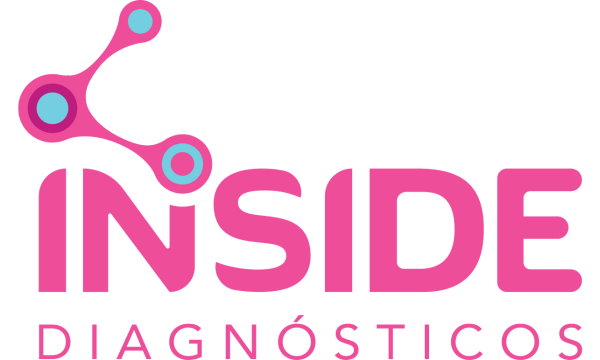

🧬 Plataforma de Análise Preditiva de Microbiota

<strong>Uma aplicação web completa para análise de dados de microbioma, utilizando Machine Learning para predições de idade e peso, e integração com a API da Google (Gemini) para geração de insights científicos.</strong>

📜 Descrição
Este projeto, desenvolvido como solução para um desafio técnico de back-end, é uma plataforma robusta que vai além dos requisitos básicos. A aplicação permite que usuários façam o upload de dados de sequenciamento de microbiota (em formato CSV ou Excel) para obter predições, análises de diversidade e laudos detalhados. A interface web, construída com Flask, oferece uma experiência de usuário intuitiva, enquanto o back-end utiliza um ecossistema de bibliotecas de Data Science e IA para entregar resultados precisos e visualmente ricos.

✨ Funcionalidades Principais
Interface Web Intuitiva: Upload de arquivos de referência e amostras-alvo diretamente pelo navegador.

Modelos Preditivos: Treinamento de modelos de Machine Learning (RandomForestRegressor) em tempo real para predizer idade (age_months) e peso (body_weight).

Métricas de Ecologia: Cálculo automático de diversidade Alfa (Shannon) e Beta (PCoA) para comparar a similaridade entre amostras.

Visualização de Dados: Geração dinâmica de gráficos de abundância e de análise de similaridade (PCoA) com Matplotlib.

Insights com IA: Integração com a API do Google Gemini para gerar resumos e insights baseados nas bactérias mais abundantes, com consulta em tempo real ao PubMed.

Exportação de Resultados: Salvamento automático de um relatório completo em formato JSON.

Gerador de Laudo Offline: Um script auxiliar para gerar o laudo visual em HTML a partir de um arquivo JSON de resultados, sem a necessidade de rodar o servidor.

🔧 Pré-requisitos
Antes de começar, garanta que você tem o seguinte instalado:

Python 3.9 ou superior

🚀 Instalação e Configuração
Siga estes passos para configurar e rodar o projeto localmente.

1. Clone o Repositório

git clone https://github.com/seu-usuario/nome-do-repositorio.git
cd nome-do-repositorio

2. Crie e Ative um Ambiente Virtual
É uma forte recomendação usar um ambiente virtual para isolar as dependências do projeto.

# Criar o ambiente
python -m venv venv

# Ativar no Windows
venv\Scripts\activate

# Ativar no macOS/Linux
source venv/bin/activate

3. Configure as Chaves de API
Este projeto precisa de chaves para as APIs do Google Gemini e do NCBI PubMed.

Crie uma cópia do arquivo de exemplo .env.example (se não existir, crie um) e renomeie para .env.

Abra o arquivo .env e insira suas chaves e e-mail.

DEV_GEMINI_API_KEY="SUA_CHAVE_REAL_DO_GEMINI_AQUI"
DEV_NCBI_API_KEY="SUA_CHAVE_REAL_DO_NCBI_AQUI"
NCBI_EMAIL="SEU_EMAIL_CADASTRADO_NO_NCBI"

⚠️ Importante: O arquivo .env já está listado no .gitignore, então suas chaves nunca serão enviadas para o GitHub.

4. Instale as Dependências
Use o arquivo requirements.txt para instalar todas as bibliotecas necessárias de uma só vez.

pip install -r requirements.txt

USAGE
Existem duas formas de utilizar esta aplicação.

1. Rodando a Aplicação Web (Servidor Local)
Esta é a forma principal de uso, que permite interagir com a plataforma através do navegador.

A. Inicie o Servidor Flask

flask run
# Ou, alternativamente:
python app.py

B. Acesse a Plataforma
Abra seu navegador e acesse o endereço:
http://127.0.0.1:5000

C. Execute a Análise

Na página inicial, faça o upload do arquivo da Base de Dados de Referência.

Faça o upload de uma ou mais Amostras Alvo.

Clique em "Analisar Amostras" e aguarde o processamento.

O laudo completo será exibido na tela e um arquivo JSON com os resultados será salvo na pasta uploads/.

2. Gerando um Laudo Offline
Se você já executou uma análise pela aplicação web, um arquivo de resultados (analysis_results_*.json) foi salvo. Você pode usar o script gerador_html.py para recriar o laudo visual sem precisar rodar o servidor.

A. Execute o Script
Use o seguinte comando, passando o caminho para o arquivo JSON como argumento:

python gerador_html.py "uploads/analysis_results_20250811_144205.json"

B. Visualize o Resultado
Um arquivo chamado laudo_visual.html será criado na raiz do projeto. Abra-o em qualquer navegador para ver o relatório.

🛠️ Tecnologias Utilizadas
Back-end: Python

Framework Web: Flask

Análise de Dados: Pandas, NumPy

Machine Learning: Scikit-learn

Análise de Bioinformática: SciPy, Scikit-bio, Biopython

Visualização: Matplotlib

IA Generativa: Google Generative AI (Gemini)

Templating: Jinja2

Gerenciamento de Segredos: python-dotenv